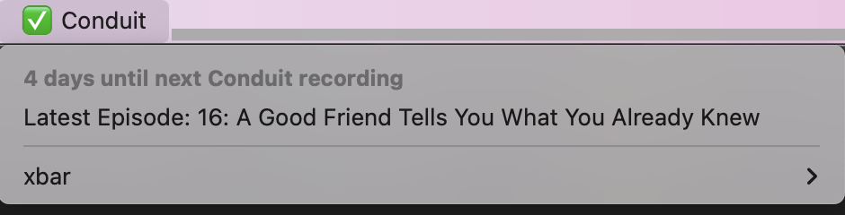

#  PodCountdown (v1.0.0)

Checks Date of Latest Podcast Episode and Alerts you when you should record or publish.
It also shows and links to the latest episode

# Variables become preferences in the app:

* PODCAST_URL: **(required)** RSS Feed URL for Podcast.
* RECORDING_DAYS_AFTER: _(optional)_ Number of days to warn before recording episode.
* RECORDING_ACTION: (optional) URL to run on click.
* PUBLISH_DAYS_AFTER): (optional) Number of days to warn before publishing episode.
* PUBLISH_ACTION: (optional) URL to run on click.

The Actions for Recording https://github.com/kjaymiller/xbar-plugins